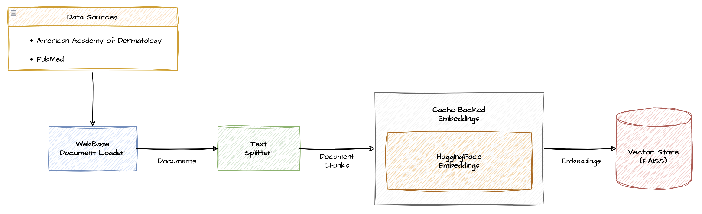

## Your AI Assitant for Skin Problems
Skin diseases are a common problems and affect about 20-25% of global population annually [1]. 
However, due to dermatologist shortage, patients suffer long waiting time for scheduling an appointment 
(averaging 36 days in the US) [2]. This causes a significant amount of stress in patients and delay in diagnosis and 
treatment of the disease. AI-powered tools can assist patients to perform preliminary diagnosis and apply home remedies 
till they visit the dermatologist. 

**DermAssist** contains a powerful vision model to classify skin disease type given the image of the affected area, and 
a Retrieval-Augmented Generation (RAG) system enriched with reliable dermatological knowledge to conduct a conversation 
and suggest remedies.

## Table of Content
- [Architecture](#architecture)
- [Vector Store Pipeline](#vector-store-pipeline)
- [Steps to run DermAssist locally](#steps-to-run-dermassist-locally)

## Architecture


## Vector Store Pipeline


## Steps to run DermAssist locally

Clone the repository:
```commandline
https://github.com/chinmaysharmacs10/DermAssist.git
cd DermAssist
```

Create virtual environment:
```commandline
Conda:
conda create --name dermassist

Pip:
python -m venv dermassist
```

Install necessary packages:
```commandline
pip install requirements.txt
```

Download ollama client from: [https://ollama.com](https://ollama.com/)

Pull Llama3-8b model: 
```commandline
ollama run llama3
```

In rag_system.py, enter your `LANGCHAIN_API_KEY` and `LANGCHAIN_PROJECT` to enable tracing via [LangSmith](https://www.langchain.com/langsmith).

To start StreamLit server:
```commandline
streamlit run dermassist_streamlit.py
```

## References
1. Xuhui Li, Xinyu Zhao, Haoran Ma, and Bin Xie. Image analysis and diagnosis of skin diseases-a
review. Current Medical Imaging, 19(3):199–242, 2023.
2. Elizabeth Uhlenhake, Robert Brodell, and Eliot Mostow. The dermatology work force: a focus on
urban versus rural wait times. Journal of the American Academy of Dermatology, 61(1):17–22, 2009.